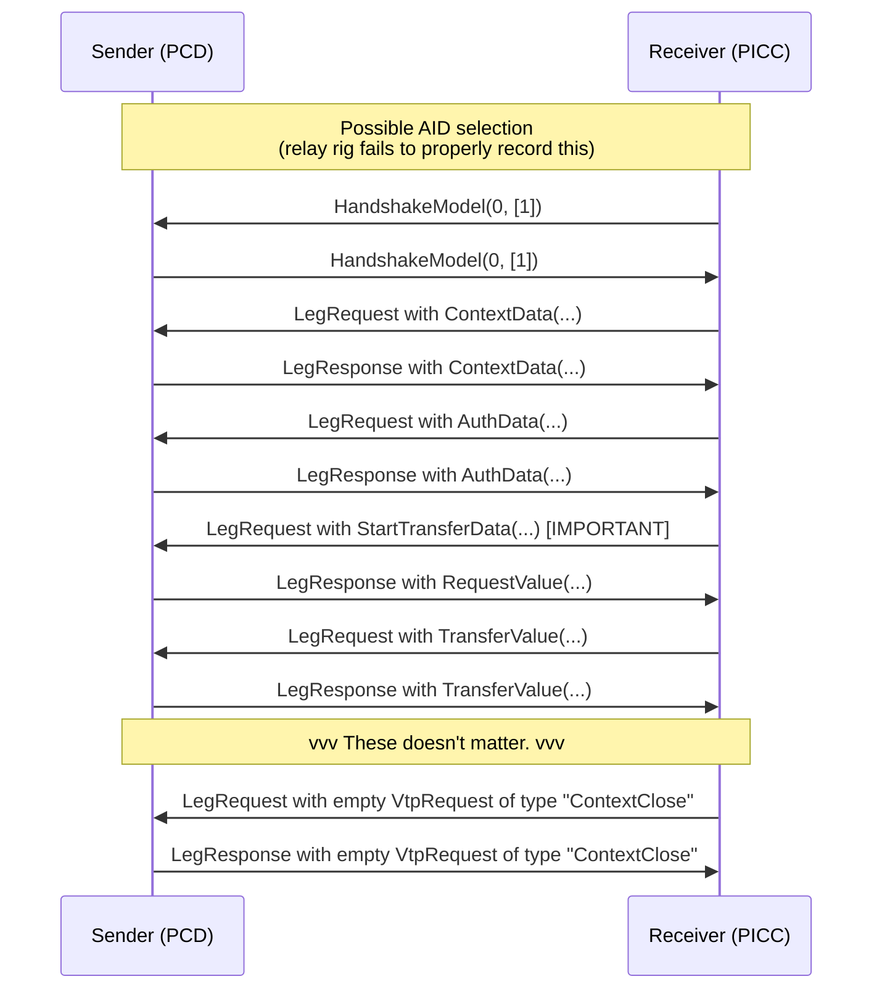

# The NFC side of UPI Lite X

# Notes:
1. [IsoDep](https://developer.android.com/reference/android/nfc/tech/IsoDep) to get hold of PICC
2. some Ndef elements in code; not sure what they do. Can be found in Payer class.
3. A different thread to manage NFC session and take care of transactions. Keyword to search is "transceive"; https://developer.android.com/reference/android/nfc/tech/IsoDep#transceive(byte[])
4. JSON encoded data sent/recvd
5. Models are dumped in nfc_models.py
6. IsoDep manages ISO-14443-4 cards. (Not a smart card. Maybe just mimicing ultralight.)

LegRequest(VtpRequest(type="OpenContext", data={"contextData": ContextData(...).dict()}))

# The flow (AFAIU)

